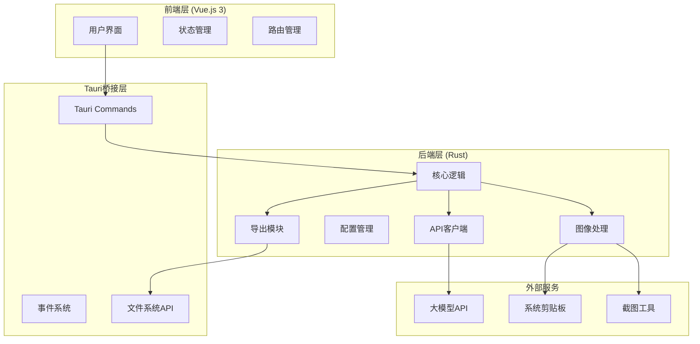
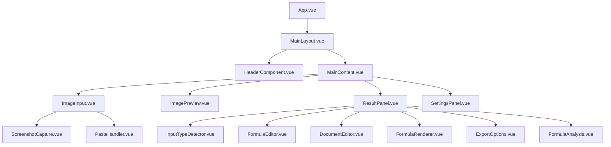

# MathSeek 设计文档

## 概述

MathSeek是一个基于Tauri 2框架的跨平台数学公式识别工具，采用现代化的技术栈：Rust后端 + Vue.js 3前端 + TailwindCSS样式。应用通过截图或粘贴方式获取包含数学公式的图像，调用大模型API进行识别，并提供多格式输出、实时编辑和AI分析功能。

## 架构

### 整体架构



### 技术栈选择

- **Tauri 2**: 提供跨平台桌面应用框架，Rust后端性能优异
- **Vue.js 3**: 现代化前端框架，组合式API提供更好的代码组织
- **TailwindCSS**: 实用优先的CSS框架，快速构建响应式界面
- **MathJax/KaTeX**: 数学公式渲染引擎
- **Rust crates**: 
  - `reqwest`: HTTP客户端
  - `serde`: 序列化/反序列化
  - `tokio`: 异步运行时
  - `image`: 图像处理

## 组件和接口

### 前端组件架构



### 核心组件说明

#### 1. ImageInput.vue
- 负责图像输入的统一入口
- 集成截图和粘贴功能
- 图像预处理和验证

#### 2. FormulaEditor.vue
- 提供LaTeX公式编辑器
- 语法高亮和错误提示
- 实时预览同步

#### 3. FormulaRenderer.vue
- 使用MathJax渲染数学公式
- 支持缩放和复制功能
- 错误状态处理

#### 4. InputTypeDetector.vue
- 自动检测输入类型（单公式/文档）
- 提供手动切换选项
- 显示检测结果和置信度

#### 5. DocumentEditor.vue
- 处理文档模式的编辑
- 支持多个公式和文本内容
- 提供结构化编辑界面

#### 6. FormulaAnalysis.vue
- 显示AI分析结果
- 公式类型和用途说明
- 分析内容的复制和导出

### Rust后端模块

#### 1. 核心模块 (core.rs)
```rust
pub struct MathSeekCore {
    config: AppConfig,
    api_client: ApiClient,
    image_processor: ImageProcessor,
    export_manager: ExportManager,
}

impl MathSeekCore {
    pub async fn detect_input_type(&self, image_data: &[u8]) -> Result<InputType>;
    pub async fn recognize_content(&self, image_data: Vec<u8>, input_type: InputType) -> Result<FormulaResult>;
    pub async fn analyze_formula(&self, formula: &str) -> Result<AnalysisResult>;
    pub fn export_content(&self, content: &ResultContent, format: ExportFormat, input_type: InputType) -> Result<String>;
    pub fn get_available_formats(&self, input_type: InputType) -> Vec<ExportFormat>;
}
```

#### 4. 导出管理器 (export_manager.rs)
```rust
pub struct ExportManager {
    config: AppConfig,
}

impl ExportManager {
    pub fn export_single_formula(&self, formula: &str, format: ExportFormat) -> Result<String>;
    pub fn export_document(&self, document: &DocumentContent, format: ExportFormat) -> Result<String>;
    pub fn format_markdown_formula(&self, formula: &str, is_inline: bool) -> String;
    pub fn generate_latex_document(&self, document: &DocumentContent) -> Result<String>;
    pub fn generate_docx(&self, content: &ResultContent) -> Result<Vec<u8>>;
}
```

#### 2. API客户端 (api_client.rs)
```rust
pub struct ApiClient {
    client: reqwest::Client,
    config: ApiConfig,
}

impl ApiClient {
    pub async fn recognize_image(&self, image: &[u8]) -> Result<String>;
    pub async fn analyze_formula(&self, formula: &str) -> Result<String>;
}
```

#### 3. 图像处理 (image_processor.rs)
```rust
pub struct ImageProcessor;

impl ImageProcessor {
    pub fn capture_screenshot() -> Result<Vec<u8>>;
    pub fn get_clipboard_image() -> Result<Option<Vec<u8>>>;
    pub fn validate_image(data: &[u8]) -> bool;
    pub fn preprocess_image(data: &[u8]) -> Result<Vec<u8>>;
    pub fn detect_input_type(data: &[u8]) -> Result<InputType>;
    pub fn analyze_image_layout(data: &[u8]) -> Result<ImageLayout>;
}

#[derive(Debug)]
pub struct ImageLayout {
    pub has_multiple_formulas: bool,
    pub has_text_content: bool,
    pub formula_regions: Vec<Region>,
    pub text_regions: Vec<Region>,
}

#[derive(Debug)]
pub struct Region {
    pub x: u32,
    pub y: u32,
    pub width: u32,
    pub height: u32,
}
```

### Tauri命令接口

```rust
#[tauri::command]
async fn capture_screenshot() -> Result<String, String>;

#[tauri::command]
async fn get_clipboard_image() -> Result<Option<String>, String>;

#[tauri::command]
async fn detect_input_type(image_data: String) -> Result<String, String>;

#[tauri::command]
async fn recognize_formula(image_data: String, input_type: String) -> Result<String, String>;

#[tauri::command]
async fn analyze_formula(formula: String) -> Result<String, String>;

#[tauri::command]
async fn export_content(content: String, format: String, input_type: String) -> Result<String, String>;

#[tauri::command]
async fn get_available_formats(input_type: String) -> Result<Vec<String>, String>;

#[tauri::command]
async fn save_config(config: String) -> Result<(), String>;

#[tauri::command]
async fn load_config() -> Result<String, String>;
```

## 数据模型

### 前端数据模型

```typescript
interface AppState {
  currentImage: string | null;
  inputType: InputType;
  recognitionResult: FormulaResult | null;
  analysisResult: AnalysisResult | null;
  isProcessing: boolean;
  config: AppConfig;
}

interface FormulaResult {
  latex: string;
  confidence: number;
  timestamp: number;
  inputType: InputType;
  content: string | DocumentContent;
}

interface DocumentContent {
  title?: string;
  sections: DocumentSection[];
}

interface DocumentSection {
  heading?: string;
  text: string;
  formulas: FormulaBlock[];
}

interface FormulaBlock {
  latex: string;
  position: number;
  isInline: boolean;
}

interface AnalysisResult {
  type: string;
  description: string;
  usage: string;
  examples?: string[];
}

interface AppConfig {
  apiEndpoint: string;
  apiKey: string;
  defaultExportFormat: Record<InputType, ExportFormat>;
  renderEngine: 'mathjax' | 'katex';
  markdownFormulaFormat: MarkdownFormulaFormat;
}

enum InputType {
  SingleFormula = 'single_formula',
  Document = 'document'
}

enum ExportFormat {
  LaTeX = 'latex',
  LaTeXInline = 'latex_inline',
  LaTeXBlock = 'latex_block',
  Markdown = 'markdown',
  MarkdownInline = 'markdown_inline',
  MarkdownBlock = 'markdown_block',
  DOCX = 'docx',
  HTML = 'html',
  PlainText = 'plain_text'
}

interface MarkdownFormulaFormat {
  inline: '$...$' | '\\(...\\)';
  block: '$$...$$' | '\\[...\\]';
}
```

### Rust数据模型

```rust
#[derive(Serialize, Deserialize)]
pub struct FormulaResult {
    pub latex: String,
    pub confidence: f32,
    pub timestamp: u64,
    pub input_type: InputType,
    pub content: ResultContent,
}

#[derive(Serialize, Deserialize)]
pub enum ResultContent {
    SingleFormula(String),
    Document(DocumentContent),
}

#[derive(Serialize, Deserialize)]
pub struct DocumentContent {
    pub title: Option<String>,
    pub sections: Vec<DocumentSection>,
}

#[derive(Serialize, Deserialize)]
pub struct DocumentSection {
    pub heading: Option<String>,
    pub text: String,
    pub formulas: Vec<FormulaBlock>,
}

#[derive(Serialize, Deserialize)]
pub struct FormulaBlock {
    pub latex: String,
    pub position: usize,
    pub is_inline: bool,
}

#[derive(Serialize, Deserialize)]
pub struct AnalysisResult {
    pub formula_type: String,
    pub description: String,
    pub usage: String,
    pub examples: Vec<String>,
}

#[derive(Serialize, Deserialize)]
pub struct AppConfig {
    pub api_endpoint: String,
    pub api_key: String,
    pub default_export_format: std::collections::HashMap<InputType, ExportFormat>,
    pub render_engine: RenderEngine,
    pub markdown_formula_format: MarkdownFormulaFormat,
}

#[derive(Serialize, Deserialize, Hash, Eq, PartialEq)]
pub enum InputType {
    SingleFormula,
    Document,
}

#[derive(Serialize, Deserialize)]
pub enum ExportFormat {
    LaTeX,
    LaTeXInline,
    LaTeXBlock,
    Markdown,
    MarkdownInline,
    MarkdownBlock,
    DOCX,
    HTML,
    PlainText,
}

#[derive(Serialize, Deserialize)]
pub struct MarkdownFormulaFormat {
    pub inline: InlineFormat,
    pub block: BlockFormat,
}

#[derive(Serialize, Deserialize)]
pub enum InlineFormat {
    Dollar,      // $...$
    Parentheses, // \(...\)
}

#[derive(Serialize, Deserialize)]
pub enum BlockFormat {
    DoubleDollar, // $$...$$
    Brackets,     // \[...\]
}
```

## 错误处理

### 错误类型定义

```rust
#[derive(Debug, thiserror::Error)]
pub enum MathSeekError {
    #[error("API调用失败: {0}")]
    ApiError(String),
    
    #[error("图像处理错误: {0}")]
    ImageError(String),
    
    #[error("配置错误: {0}")]
    ConfigError(String),
    
    #[error("导出错误: {0}")]
    ExportError(String),
    
    #[error("网络错误: {0}")]
    NetworkError(#[from] reqwest::Error),
    
    #[error("IO错误: {0}")]
    IoError(#[from] std::io::Error),
}
```

### 前端错误处理策略

1. **API错误**: 显示用户友好的错误信息，提供重试选项
2. **网络错误**: 检查网络连接，提供离线模式提示
3. **配置错误**: 引导用户重新配置API设置
4. **图像错误**: 提示用户检查图像格式和内容

## 测试策略

### 单元测试

#### Rust后端测试
```rust
#[cfg(test)]
mod tests {
    use super::*;
    
    #[tokio::test]
    async fn test_formula_recognition() {
        // 测试公式识别功能
    }
    
    #[test]
    fn test_image_validation() {
        // 测试图像验证逻辑
    }
    
    #[test]
    fn test_export_formats() {
        // 测试各种导出格式
    }
}
```

#### 前端组件测试
```typescript
// FormulaEditor.test.ts
import { mount } from '@vue/test-utils'
import FormulaEditor from '@/components/FormulaEditor.vue'

describe('FormulaEditor', () => {
  test('renders formula correctly', () => {
    // 测试公式渲染
  })
  
  test('handles input validation', () => {
    // 测试输入验证
  })
})
```

### 集成测试

1. **端到端流程测试**: 从图像输入到结果导出的完整流程
2. **API集成测试**: 测试与大模型API的交互
3. **跨平台兼容性测试**: 确保Windows平台的功能正常

### 性能测试

1. **图像处理性能**: 测试不同大小图像的处理时间
2. **API响应时间**: 监控API调用的延迟
3. **内存使用**: 确保长时间使用不会内存泄漏
4. **公式渲染性能**: 测试复杂公式的渲染速度

## 安全考虑

### 数据安全
- API密钥加密存储
- 图像数据本地处理，不上传敏感信息
- 用户配置文件权限控制

### 网络安全
- HTTPS通信
- API请求签名验证
- 请求频率限制

### 应用安全
- 输入验证和清理
- 防止代码注入
- 文件系统访问权限控制